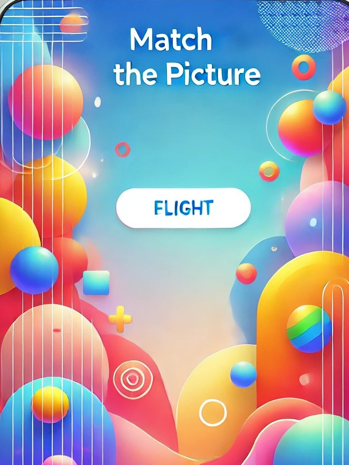
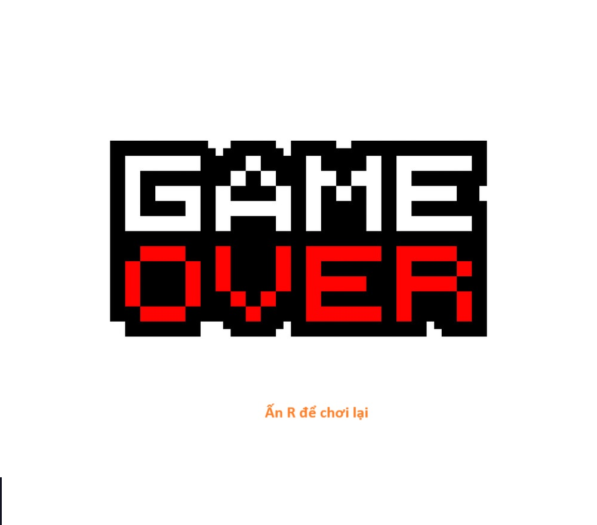

# Memory Card Game (SDL2)  
# Demo : [[https://www.youtube.com/watch?v=nwsQB1ujEGI](https://www.youtube.com/watch?v=6zq7PEMpL18)](https://www.youtube.com/watch?v=6zq7PEMpL18)
# 📖 Giới thiệu
Memory Card Game là một trò chơi lật hình được xây dựng bằng C++ và SDL2, nơi người chơi cần tìm ra tất cả các cặp hình giống nhau trong khoảng thời gian giới hạn. Trò chơi bao gồm hiệu ứng hình ảnh, âm thanh, hệ thống điểm số cao và một giao diện trực quan giúp người chơi có trải nghiệm tốt nhất.  

# 0. Cách tải game
## a. Cách 1: Không bao gồm code.
Tải game (được nén thành .zip) tại link sau: https://github.com/shinnichikudo/baitaplon-ltnc/releases/tag/final
Cách này tiết kiệm bộ nhớ và thời gian tải đi rất nhiều 
Giải nén game vào một thư mục và bật main.exe

## b. Cách 2: Bao gồm code và có thể biên dịch.
: Clone repo này về (hơi nặng do có cả lịch sử các phiên bản).
Hoặc Chọn Code -> Download Zip 

# 🛠️ Cài đặt
## 1. Yêu cầu hệ thống  
Hệ điều hành: Windows / Linux / macOS  
Thư viện cần thiết:  
SDL2  
SDL2_image  
SDL2_ttf  
SDL2_mixer  
## 2. Cài đặt SDL2 và các thư viện liên quan  
Trên Windows:
Tải SDL2, SDL2_image, SDL2_ttf, SDL2_mixer từ trang chủ: https://github.com/libsdl-org/SDL
Giải nén và đặt thư viện vào thư mục dự án.
Cấu hình trình biên dịch để liên kết với các thư viện SDL2.

## 3. Biên dịch và chạy game
sh
Sao chép
Chỉnh sửa
g++ -o memory_game main.cpp -lSDL2 -lSDL2_image -lSDL2_ttf -lSDL2_mixer
./memory_game
#🚀 Bắt đầu chơi
Chạy game bằng cách mở ứng dụng hoặc sử dụng dòng lệnh như trên.

Màn hình bắt đầu sẽ hiển thị với nút "Start".
Nhấn vào "Start" để bắt đầu trò chơi.

# 🎮 Cách chơi
## 🎯 Mục tiêu
Lật các thẻ bài để tìm ra các cặp hình giống nhau.
Hoàn thành tất cả các cặp trong vòng 60 giây để chiến thắng.

## 🖱️ Điều khiển
Click chuột trái để lật một thẻ.
Nhấn phím R để chơi lại khi kết thúc trò chơi.
## 🔄 Cách hoạt động
Click vào một ô để lật hình đầu tiên.
Click vào một ô khác để lật hình thứ hai.
Nếu hai hình giống nhau, chúng sẽ giữ nguyên.
Nếu khác nhau, chúng sẽ úp lại sau 1 giây.
Khi tất cả cặp hình được ghép xong, bạn chiến thắng.
## 🏆 Chiến thắng và Thất bại
### 🥳 Chiến thắng
Ghép đúng tất cả cặp hình trước khi hết giờ.
Hiển thị màn hình chúc mừng và số lần lật bài.
Nếu đạt số lần lật thấp nhất, điểm sẽ được lưu vào highscore.txt.

### 😢 Thất bại
Hết 60 giây mà chưa ghép xong tất cả cặp hình.
Hiển thị màn hình "Game Over" và tùy chọn chơi lại.

## 🎨 Đồ họa game
Game sử dụng hình ảnh được tải bằng SDL2_image.
Màn hình nền, các thẻ bài, nút bấm đều được hiển thị bằng SDL_Texture.
Hiệu ứng chuyển đổi giữa các màn hình giúp tăng trải nghiệm mượt mà.  

# 🎮 Các tính năng nổi bật (nâng cao ) của Memory Card Game (Game Lật Hình)
## ⏱️ Hệ thống đếm thời gian
Game có đồng hồ đếm giờ giúp người chơi tự đánh giá hiệu suất chơi của mình. Thời gian hoàn thành nhanh sẽ là một tiêu chí để vượt qua các kỷ lục trước đó.

## 🏆 Lưu High Score (kỷ lục)
Kết quả chơi tốt nhất sẽ được lưu lại để người chơi có thể so sánh, cải thiện kỹ năng và đặt mục tiêu cao hơn.

 ## 🔊 Hiệu ứng âm thanh
Game tích hợp hệ thống âm thanh (qua file sound.h) để tạo hiệu ứng khi lật bài, ghép đúng hoặc kết thúc trận. Điều này giúp tăng trải nghiệm tương tác cho người chơi.

## 🖼️ Hình ảnh trực quan
Giao diện đồ họa dễ nhìn, với các màn hình riêng như:

Màn hình chính (Start Screen)
Màn hình chiến thắng (Win)
Màn hình Game Over
## Hình nền và hiệu ứng khi lật bài
🃏 Lật bài mượt mà, logic đơn giản
Người chơi chỉ cần click chuột để lật bài. Các thuật toán xử lý việc so khớp cặp hình và hiệu ứng thời gian chờ khi lật 2 lá khác nhau.

## 💾 Chạy được trên nhiều nền tảng
Game được lập trình bằng C++ sử dụng thư viện SDL2, SDL_image, SDL_ttf... nên có thể build và chạy được trên cả Windows lẫn Linux.

## 🧩 Cấu trúc mã nguồn rõ ràng, dễ mở rộng
Toàn bộ game được chia thành các file .cpp, .h riêng biệt, giúp người khác dễ hiểu, dễ chỉnh sửa và phát triển thêm tính năng mới.  
## Tạm dừng - Pause Game  
Nhấn phím P để tạm dừng trò chơi.

Khi pause, ảnh nền sẽ thay đổi để hiển thị giao diện "Tạm dừng".  

Thời gian sẽ dừng lại, giữ nguyên trạng thái các lá bài đang mở.  

Nhấn P lần nữa để tiếp tục trò chơi từ thời điểm dừng lại.  

# 📝 Giới thiệu source code
Source code được tổ chức đơn giản, dễ hiểu, phù hợp với cả người mới học lập trình game bằng C++ và SDL2. Dưới đây là tổng quan các thành phần và hàm chính:
## 📁 Cấu trúc thư mục dự án

| File / Thư mục                | Mô tả                                                                 |
|------------------------------|----------------------------------------------------------------------|
| `main.cpp`                   | File mã nguồn chính, chứa toàn bộ logic và vòng lặp game.            |
| `sound.h`                    | Khai báo lớp `SoundManager` để quản lý âm thanh.                     |
| `sound.cpp`                  | Cài đặt chi tiết các hàm xử lý âm thanh (nhạc nền, âm thắng,...).   |
| `highscore.txt`             | File lưu kỷ lục số lần lật bài ít nhất.                              |
| `arial.ttf`                 | Font chữ dùng để hiển thị văn bản trong game.                        |
| `/ảnh sdl/`               | Thư mục chứa hình ảnh của game  |
| ├── `image1.jpg` → `image8.jpg` | Các hình ảnh thẻ bài (8 cặp ảnh).                                   |
| ├── `background.jpg`        | Hình nền màn hình start.                                             |
| ├── `image7.png`            | Hình ảnh nút Start.                                                  |
| ├── `winner.png`            | Hình ảnh khi chiến thắng.                                            |
| ├── `gameover.jpg`          | Hình ảnh khi thua (hết thời gian).                                   |
| `README.md`                 | Tài liệu mô tả game, cách chạy, điều khiển, v.v.                     |
| `Makefile` / `.vcxproj`     | (nếu có) Dùng để biên dịch trên Linux hoặc Visual Studio.           |

## 🎮 Chức năng các hàm trong game

---

### 🖼️ Nhóm hiển thị (Rendering)

| Hàm                       | Tham số                             | Chức năng                                                                 |
|--------------------------|--------------------------------------|--------------------------------------------------------------------------|
| `renderStartScreen()`    | –                                    | Hiển thị màn hình bắt đầu với nút "Start".                               |
| `renderGame()`           | –                                    | Vẽ toàn bộ lưới thẻ bài lên màn hình.                                    |
| `renderText()`           | `const string& text, int x, int y`   | Hiển thị văn bản tại vị trí x, y bằng SDL_ttf.                           |
| `renderTime()`           | `Uint32 startTime`                   | Hiển thị đồng hồ đếm ngược (giới hạn thời gian chơi).                    |
| `renderWinScreen()`      | –                                    | Hiển thị màn hình chiến thắng và số lần lật, best record.                |
| `renderGameOverScreen()` | –                                    | Hiển thị màn hình "Game Over" khi hết thời gian.                         |
| `renderPauseScreen()`    | –                                    | Hiển thị màn hình tạm dừng khi nhấn P, giữ nguyên trạng thái hiện tại.   |
---

### 🧠 Nhóm logic game

| Hàm                       | Tham số          | Chức năng                                                                 |
|--------------------------|------------------|--------------------------------------------------------------------------|
| `shuffleBoard()`         | –                | Trộn ngẫu nhiên các cặp thẻ bài (16 thẻ → 8 cặp).                        |
| `checkMatch()`           | –                | Kiểm tra xem hai thẻ vừa lật có trùng nhau không.                        |
| `checkWin()`             | –                | Kiểm tra xem người chơi đã lật đúng toàn bộ thẻ hay chưa.               |
| `resetGame()`            | –                | Đặt lại trạng thái game để chơi lại.                                     |
| `handleMouseClick()`     | `int x, int y`   | Xử lý khi người chơi click chuột vào vị trí (x, y).                      |
| `togglePause()`     | –      | Dừng/tái tiếp tục trò chơi khi nhấn phím P.                   |
---

### 🔊 Nhóm âm thanh (`sound.h`)

| Hàm                            | Tham số      | Chức năng                                                        |
|-------------------------------|--------------|------------------------------------------------------------------|
| `sound.init()`                | –            | Khởi tạo hệ thống âm thanh.                                      |
| `sound.playBackgroundMusic()`| –            | Phát nhạc nền vòng lặp.                                          |
| `sound.stopBackgroundMusic()`| –            | Dừng nhạc nền.                                                   |
| `sound.playWinSound()`        | –            | Phát âm thanh khi chiến thắng.                                   |
| `sound.cleanUp()`             | –            | Giải phóng bộ nhớ âm thanh khi thoát game.                       |

---

### 💾 Nhóm lưu điểm cao (High Score)

| Hàm                  | Tham số         | Chức năng                                                            |
|---------------------|-----------------|----------------------------------------------------------------------|
| `readHighScore()`   | –               | Đọc số lần lật ít nhất từ file `highscore.txt`.                      |
| `saveHighScore()`   | `int flips`     | Lưu số lần lật nếu thấp hơn kỷ lục cũ.                               |

---

### 📦 Nhóm hỗ trợ

| Hàm              | Tham số              | Chức năng                                                       |
|------------------|----------------------|-----------------------------------------------------------------|
| `loadTexture()`  | `const string& path` | Tải hình ảnh từ file và trả về `SDL_Texture*`.                 |  

# Mã nguồn kham khảo  
KHÔNG CÓ  

# Các tài nguyên ảnh 
https://in.pinterest.com/search/pins/?q=nh%C3%A2n%20v%E1%BA%ADt%20trong%20conan&rs=rs&source_id=AParVcoy&eq=&etslf=1735 (8 ảnh đầu )
https://in.pinterest.com/
https://www.flaticon.com/free-icon/winner_3508754
https://www.pngkit.com/view/u2w7r5o0o0q8w7r5_game-over-white-red-b-game-over-button/
https://chatgpt.com/

# AI hỗ trợ : Chat GPT , Google Studio Ai 
## cụ thể :  
gợi ý các hàm cần có  
Tìm và sửa lỗi (Debugging Assistant)
hướng dẫn cài đặt sdl mixer,sdl tft  
hướng dẫn viết 1 số hàm nằm ngoài chương trình học như hàm âm thanh , chữ viết,...  
Tối ưu mã và cải thiện hiệu năng  
Gợi ý cách tránh lặp code, cải thiện tốc độ vẽ màn hình.  
Hỗ trợ Viết tài liệu README
# Các tài nguyên âm thanh  
https://tiengdong.com/nhac-nen-boc-tham-trung-thuong 
https://tiengdong.com/
https://tiengdong.com/nhac-doc-ve-cha-cha-cha
 
# Thank you so much for your support. Wishing you good health and all the best always!

